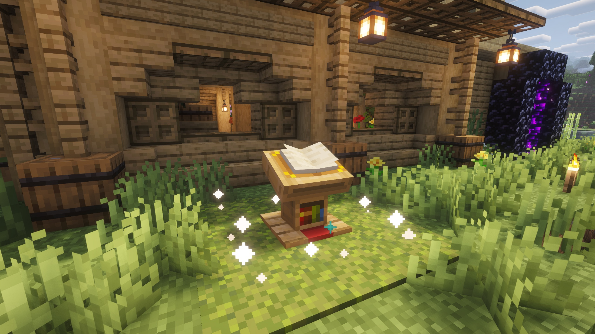

# SafeBase : Create safe zones with vanilla blocks!

**SafeBase** lets you create a safe zone around your base. Permit only your friends and teammates. Griefers get stopped at an invisible barrier!

## How it works

Place a **lectern** on top of a **block of white wool**, then add a **book-and-quill** to the lectern. That's all it takes to create a zone of protection around the lectern. You'll see particles start to swirl nearby.

By default _only you can enter_ your SafeBase. The safe zone takes the shape of a square **128 blocks across**, centered around the lectern, and extends the entire height of the world.

## Who's allowed in?

If you write the names of your friends in the book, _they'll also be given permission to enter_ your SafeBase.

## Can I keep out only certain players?

If you use a _black_ block of wool instead of white, the list of names in the book becomes a "blacklist" -- in other words, a list of players who _cannot_ enter.

## What happens when someone is forbidden into my SafeBase?

When approaching your SafeBase (within 32 blocks) the player sees a warning, and then if they continue to try to enter your SafeBase they are nudged back outside the safe zone.

The forbidden player cannot use Ender Pearls, Nether Portals, Chorus Fruit, etc to get inside. All teleportation options are cancelled by the server.

If -- somehow -- they did manage to get inside anyway, a background timer will always kick them out after 2 seconds.

## Customise the zone size

You can add up to _8 more blocks_ of wool next to the original block, to expand the size of your SafeBase. Each _additional_ block of wool expands your SafeBase by another 64 blocks across. The maximum size of a size is 640 blocks across, using 9 pieces of wool.

## For Admins and Ops

Ops bypass all SafeBase enforcement.

Only permitted players can use SafeBase. Ops _opt-in_ players to SafeBase with the `/safebase allow` command. Or the server owner can manually edit config.yml after first launch.

Ops also have commands for listing and disabling SafeBases. See `/safebase help` for the full list of options.

A config file controls zone geometry, warning cooldowns, and the particle effect (beacon beam, colored column, rotating ring, or shield dome).

## Technical

This plugin works on Paper 1.21. Zones and config are stored as simple YAML files. There are no other plugin dependencies.
